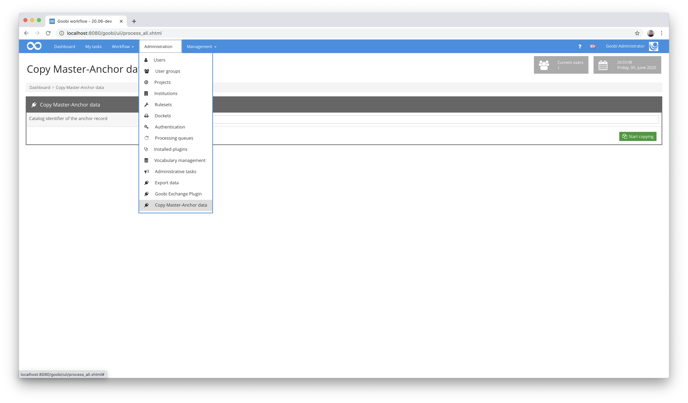

# Copy Master-Anchor

## Introduction

This documentation describes the installation, configuration and use of the Administration Plugin for the automated transfer of a central anchor file of a volume \(e.g. from periodicals or multi-volume works\) to other volumes within Goobi workflow.

| Details |  |
| :--- | :--- |
| Version | 1.0.0 |
| Identifier | intranda\_administration\_copymasteranchor |
| Source code | [https://github.com/intranda/goobi-plugin-administration-copyanchor](https://github.com/intranda/goobi-plugin-administration-copyanchor) |
| Licence | GPL 2.0 or newer |
| Compatibility | Goobi workflow 2020.05 |
| Documentation date | 05.06.2020 |

## Installation

The plugin consists of the following files to be installed

```text
plugin_intranda_administration_copyanchor.jar
plugin_intranda_administration_copyanchor-GUI.jar
```

These files must be installed in the correct directories so that they are available in the following paths after installation:

```bash
/opt/digiverso/goobi/plugins/administration/plugin_intranda_administration_copyanchor.jar
/opt/digiverso/goobi/plugins/GUI/plugin_intranda_administration_copyanchor-GUI.jar
```

There is currently no configuration file for this plugin.

## Configuration

The plugin does not have its own configuration file. Nevertheless, an adaptation of the ruleset used is a mandatory requirement for the operation of the plugin. An example of this is a ruleset that can be found under the following path:

```bash
/opt/digiverso/goobi/rulesets/ruleset.xml
```

Within the ruleset, the metadata `InternalNote` must be defined:

```markup
<MetadataType>
  <Name>InternalNote</Name>
  <language name="de">Interne Goobi-Anmerkung</language>
  <language name="en">Internal Note for Goobi</language>
</MetadataType>
```

This metadata must now be allowed within the definition of the volumes. Using a periodical volume as an example, this is done like this:

```markup
<DocStrctType topStruct="true">
  <Name>PeriodicalVolume</Name>
  <language name="de">Zeitschriftenband</language>
  <language name="en">Periodical volume</language>
  <!-- Definitions of other metadata and structure elemtents skipped here -->
  <metadata num="*">InternalNote</metadata>
</DocStrctType>
```

With this adjustment to the ruleset, the preparations for using the plugin are already complete.

## Using the plug-in within Goobi

### Definition of a Master Anchor

After the plugin is fully configured, it can be used. To do this, first add the newly defined metadata `InternalNote` within the volume that is to be marked as the master anchor and enter as value `AnchorMaster`. The following screenshot illustrates this:


With this change, the thus adjusted periodical volume was defined as a master. From now on, the metadata of the parent work \(e.g. the periodical\) used there will serve as master for all other related volumes. Changes that are to be made for all volumes within the anchor files are therefore from now on made within this record.


### Transfer of metadata for all associated volumes

Once a volume has been defined as the master within a Goobi process, the plug-in can be used to transfer all the metadata of the master to all the associated volumes. To do this, proceed as follows:

First open the plugin via the menu `Administration` and there the menu item `Copy Master-Anchor data`.



In the input field of the plugin, enter the catalog identifier of the parent work \(e.g. the ID of the periodical\) and then click on the button 'Start copying'. This will start the copy process, which automatically copies the metadata of the master anchor record to all associated volumes \(e.g. all volumes of the periodical\).


