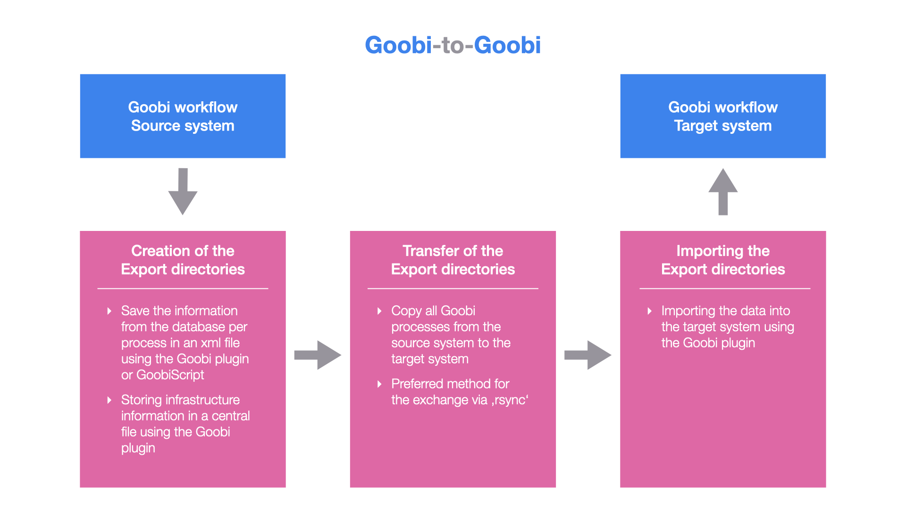

# Goobi-to-Goobi

## 1. Introduction

The two plugins described here can be used to transfer data from one Goobi workflow system to another Goobi workflow system \(`Goobi-to-Goobi`\). This documentation explains how to install, configure and use the associated plugins.

| Details |  |
| :--- | :--- |
| Version | 1.0.0 |
| Identifier | intranda\_administration\_goobi2goobi\_export  intranda\_administration\_goobi2goobi\_import\_infrastructure  intranda\_administration\_goobi2goobi\_import\_data |
| Source code | [https://github.com/intranda/goobi-plugin-administration-goobi2goobi-export](https://github.com/intranda/goobi-plugin-administration-goobi2goobi-export)  [https://github.com/intranda/goobi-plugin-administration-goobi2goobi-import](https://github.com/intranda/goobi-plugin-administration-goobi2goobi-import) |
| Licence | GPL 2.0 oder neuer |
| Compatibility | 2020.06 |
| Documentation date | 24.06.2020 |

## 1. Installation and configuration

Before the export and import mechanism can be used, various installation and configuration steps must be completed. These are described in detail here:



## 2. Mode of operation

The mechanism for transferring data from one Goobi workflow system to another Goobi workflow system \(`Goobi-to-Goobi`\) is divided into three major steps.

These three steps are as follows:

### a\) Creation of the export directories

The first step involves enriching the data within the file system on the source system with the information that Goobi has stored internally in the database for each process. When this step is performed, an additional xml file containing the database information on the workflow and some other necessary data is written to the folder for each Goobi process.



### b\) Transfer of the export directories

After the complete creation and enrichment of the export directories on the source system, they can be transferred to the server of the target system. This can be done in different ways. Due to the amount of data involved, a transfer using `rsync` has proven to be the most suitable.



### c\) Importing the export directories

After the export directories have been successfully transferred to the target system, the data can be imported there. To do this, the data must be stored in the correct place in the system and some further precautions regarding the infrastructure must also be prepared.


