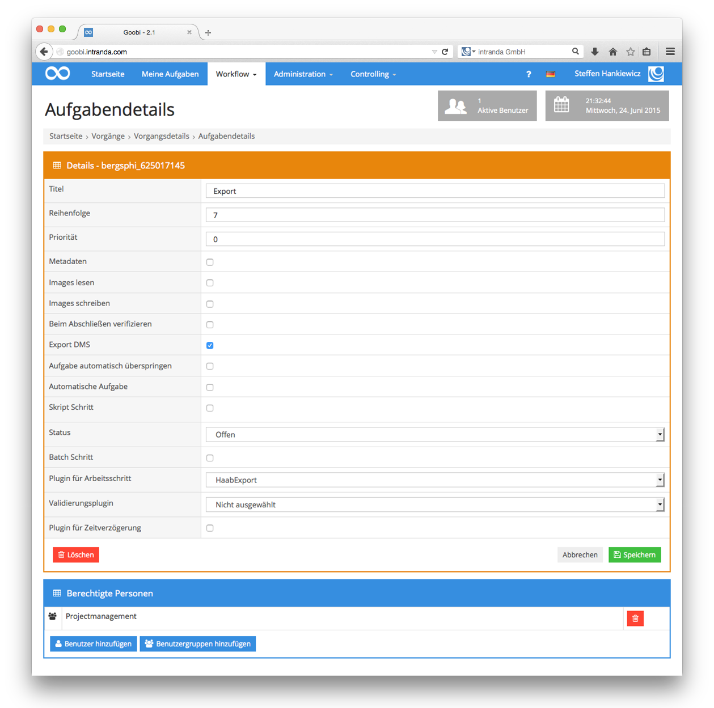

# HAAB Export

## Introduction

This documentation describes the installation, configuration and use of an export plug-in in Goobi, as required for the Klassik Stiftung Weimar within the digitization project. With the help of this Goobi export plug-in, Goobi processes can be simultaneously exported to several locations within a single workflow step. The special features of the Klassik Stiftung Weimar, such as the use of EPNs as identifiers and the merging of covers and sheet cuts into a common structural element, remain unchanged.

| Details |  |
| :--- | :--- |
| Version | 1.0.0 |
| Identifier | HaabExport |
| Source code | [https://github.com/intranda/goobi-plugin-export-haab](https://github.com/intranda/goobi-plugin-export-haab) |
| Licence | GPL 2.0 or newer |
| Compatibility | Goobi workflow 2.1 and newer |
| Documentation date | 17.06.2015 |

## Preconditions and Installation

The precondition for using the export plug-in is the use of Goobi 2.1 or newer and the subsequent correct installation and configuration of the plug-in as well as the correct integration of the plug-in into the desired workflow steps.

## Configuration

The plugin must first be installed in the following directory:

```text
/opt/digiverso/goobi/plugins/export/plugin_intranda_export_Haab.jar
```

In the Goobi configuration directory, the additional plug-in configuration file must be made available under the following path during installation:

```text
/opt/digiverso/goobi/config/plugin_HaabExportPlugin.xml
```

The content of this configuration file is structured as follows:


```markup
<config_plugin>
        <exportFolder>/opt/digiverso/viewer/hotfolder/</exportFolder>
        <exportFolder>/opt/digiverso/archive/</exportFolder>
</config_plugin>
```


The `exportFolder` list can be used to define various locations to which the export is to be made. Any number of folders can be defined. However, at least one folder must be defined at this point.

In order to be able to use the export plug-in within the workflow after successful installation, a work step must be defined in which the Export DMS function was activated. In addition, the value `HaabExport` must be entered as the step plug-in.



