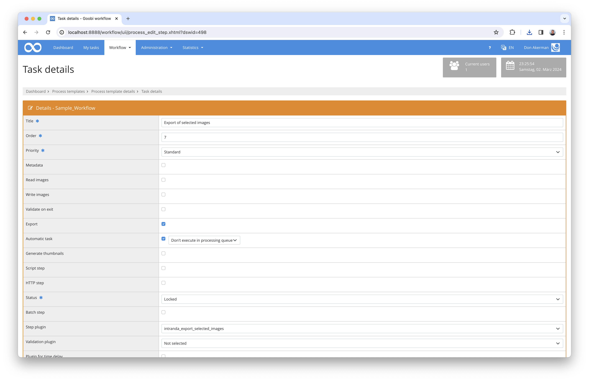

# Selected Images Export

## Introduction

This documentation describes the installation, configuration and use of the Selected Images Export plugin in Goobi.

Using this plugin for Goobi, Goobi operations can export the selected images and potentially also a generated JSON or/and METS file for these images to the configured location within one step.

| Details |  |
| :--- | :--- |
| Identifier | intranda_export_selected_images |
| Source code | [https://github.com/intranda/goobi-plugin-export-selected-images](https://github.com/intranda/goobi-plugin-export-selected-images) |
| Licence | GPL 2.0 or newer |
| Compatibility | Goobi workflow 23.04 or newer |
| Documentation date | 12.May.2023 |

## Installation

This plugin is integrated into the workflow in such a way that it is executed automatically. For use within a workflow step, it should be configured as shown in the screenshot below.



The plugin must first be copied to the following directory:

```text
/opt/digiverso/goobi/plugins/export/plugin_intranda_export_selected_images.jar
```

In addition, there is a configuration file that must be located in the following place:

```text
/opt/digiverso/goobi/config/plugin_intranda_export_selected_images.xml
```
## Configuration

The plugin is configured via the configuration file `plugin_intranda_export_selected_images.xml`. The configuration can be adjusted during operation. The following is an example configuration file:

```xml
<?xml version="1.0" encoding="UTF-8"?>
<config_plugin>
	<!-- 
	Order of configuration is: 
	1.) project name matches
	2.) project is * 
	-->

	<!-- There could be multiple config blocks. -->
	<!-- Please make sure that the project names of different config blocks are also different. -->
	<!-- Given two config blocks with the same project name, the settings of the first one will be taken. -->
	<config>
		<project>*</project>
		<step>*</step>
		<!-- whether or not to export a JSON file, DEFAULT false -->
		<exportJSON>true</exportJSON>
		<!-- whether or not to export a METS file, DEFAULT false -->
		<exportMetsFile>false</exportMetsFile>
		<!-- whether or not to create subfolders for the results in the target folder, DEFAULT false -->
		<createSubfolders>true</createSubfolders>
		<!-- the name of the process property which contains information of selected images -->
		<propertyName>plugin_intranda_step_image_selection</propertyName>
		<!-- name of the source folder, media | master | ... -->
		<sourceFolder>media</sourceFolder>
		<!-- absolute path to the target folder for the export, where there is no difference whether you append a '/' to the end or not -->
		<targetFolder>CHANGE_ME</targetFolder>
		
		<!-- whether or not to use scp for the export, DEFAULT false -->
		<useScp>false</useScp>
		<!-- name to login to the remote server via ssh, MANDATORY if useScp is set true  -->
		<scpLogin>CHANGE_ME</scpLogin>
		<!-- password to login to the remote server via ssh, MANDATORY if useScp is set true -->
		<scpPassword>CHANGE_ME</scpPassword>
		<!-- name or ip of the remote host that awaits the export, MANDATORY if useScp is set true -->
		<scpHostname>CHANGE_ME</scpHostname>
		
		<!-- use default settings for the JSON format outside of config blocks -->
		
		<!-- values that are needed for the JSON file, MANDATORY if exportJSON is set true --> 
		<json_values>
			<!-- id number for the first selected image -->
			<idStart>15700682</idStart>
			<!-- step number that should be added to generate the id number for the next selected image, 0 and negative integers are also acceptable -->
			<idStep>1</idStep>
			<!-- HERIS ID -->
			<herisId>37</herisId>
		</json_values>
	</config>
        
	<config>
		<project>Manuscript_Project</project>
		<step>*</step>
		<exportJSON>false</exportJSON>
		<exportMetsFile>false</exportMetsFile>
		<createSubfolders>true</createSubfolders>
		<!-- propertyName can also be set using a goobi variable -->
		<propertyName>{process.NAME}</propertyName>
		<!-- media | master | ... -->
		<sourceFolder>media</sourceFolder>
		<!-- path can also be set using a goobi variable, where there is no difference whether you add a '/' between '}' and '..' or not -->	
		<targetFolder>{goobiFolder}../viewer/hotfolder/</targetFolder>
		
		<useScp>false</useScp>
		<scpLogin>CHANGE_ME</scpLogin>
		<scpPassword>CHANGE_ME</scpPassword>
		<scpHostname>CHANGE_ME</scpHostname>
		
		<!-- uncomment this block if you want to configure JSON format specifically for this project -->
		<!--
		<json_format>
			<images></images>
			<herisId></herisId>
			<id></id>
			<title></title>
			<altText></altText>
			<symbolImage></symbolImage>
			<mediaType></mediaType>
			<creationDate></creationDate>
			<copyRightBDA></copyRightBDA>
			<fileInformation></fileInformation>
			<publishable></publishable>
			<migratedInformation></migratedInformation>
		</json_format>
		-->
        
		<!-- values that are needed for the JSON file --> 
		<json_values>
			<idStart>15700682</idStart>
			<idStep>1</idStep>
			<herisId>37</herisId>
		</json_values>
	</config>
    
	<!-- configure here the default settings for the JSON format -->
	<json_format>
		<images>Bilder</images>
		<herisId>HERIS-ID</herisId>
		<id>Id</id>
		<title>Titel</title>
		<altText>alt_text</altText>
		<symbolImage>Symbolbild</symbolImage>
		<mediaType>media_type</mediaType>
		<creationDate>Aufnahmedatum</creationDate>
		<copyRightBDA>Copyright BDA</copyRightBDA>
		<fileInformation>Dateiinformation</fileInformation>
		<publishable>publikationsfähig</publishable>
		<migratedInformation>Migrierte Information</migratedInformation>
	</json_format>

</config_plugin>
```
