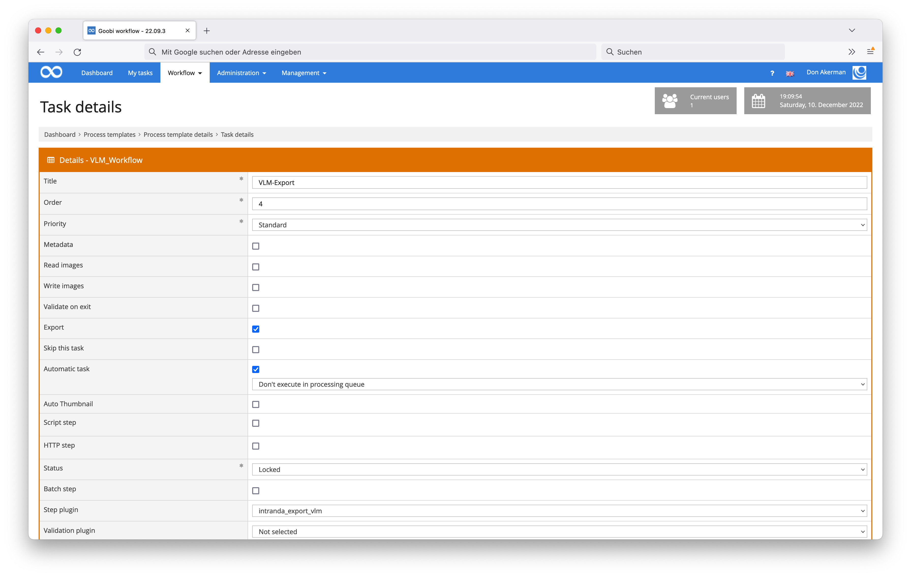

# VLM Export

## Introduction

This documentation describes the installation, configuration and use of the VLM export plugin in Goobi.

Using this plugin for Goobi, Goobi operations can be exported to the configured location for VLM within one step.

| Details |  |
| :--- | :--- |
| Identifier | intranda_export_vlm |
| Source code | [https://github.com/intranda/goobi-plugin-export-vlm](https://github.com/intranda/goobi-plugin-export-vlm) |
| Licence | GPL 2.0 or newer |
| Compatibility | Goobi workflow 2022.10 or newer |
| Documentation date | 16.Nov.2022 |

## Installation

This plugin is integrated into the workflow in such a way that it is executed automatically. For use within a workflow step, it should be configured as shown in the screenshot below.



The plugin must first be copied to the following directory:

```text
/opt/digiverso/goobi/plugins/export/plugin_intranda_export_vlm.jar
```

In addition, there is a configuration file that must be located in the following place:

```text
/opt/digiverso/goobi/config/plugin_intranda_export_vlm.xml
```
## Configuration

The plugin is configured via the configuration file `plugin_intranda_export_vlm.xml`. The configuration can be adjusted during operation. The following is an example configuration file:

```xml
<?xml version="1.0" encoding="UTF-8"?>
<config_plugin>
	<!-- 
	Order of configuration is: 
	1.) project name matches
	2.) project is * 
	-->

	<!-- There could be multiple config blocks. -->
	<!-- Please make sure that the project names of different config blocks are also different. -->
	<!-- Given two config blocks with the same project name, the settings of the first one will be taken. -->
	<config>
		<!-- The name of the project -->
		<!-- MANDATORY -->
		<project>Archive_Project</project>
		
		<!-- The field to use as identifier e.g. CatalogIDDigital.  -->
		<!-- MANDATORY -->
		<identifier>CatalogIDDigital</identifier>
	    
		<!-- The name to be used to distinguish between different volumes of one book series. -->
		<!-- Alternatively one may also choose "TitleDocMain", just assure its difference between volumes. -->
		<!-- Leave the default value unchanged if the book is a one-volume work. -->
		<!-- MANDATORY -->
		<volume>CurrentNoSorting</volume>
	    
		<!-- The place you would like to use for the export. -->
		<!-- Absolute path expected. No difference whether you append the directory separator '/' to the end or not. -->
		<!-- If left blank, then the default setting '/opt/digiverso/viewer/hotfolder' will be used. -->
		<path></path>
	    
		<!-- The prefix you would like to use for subfolders for different volumes. -->
		<!-- Leave it blank if no common prefix is needed. -->
		<subfolderPrefix>T_34_L_</subfolderPrefix>
	</config>
	
	<config>
		<project>Manuscript_Project</project>		
		<identifier>CatalogIDDigital</identifier>		
		<volume>CurrentNoSorting</volume>	
		<!-- Setting up path using a goobi variable. -->
		<!-- No difference whether you add a '/' between '}' and '..' or not. -->		
		<path>{goobiFolder}../viewer/hotfolder/</path>
		<!-- No common prefix needed. -->
		<subfolderPrefix></subfolderPrefix>
	</config>
	
	<config>
		<project>*</project>
		<identifier>CatalogIDDigital</identifier>
		<volume>CurrentNoSorting</volume>		
		<!-- Setting up path using an ABSOLUTE path. -->
		<path>/opt/digiverso/viewer/hotfolder</path>
		<!-- No common prefix needed. -->
		<subfolderPrefix></subfolderPrefix>
	</config>

</config_plugin>
```

| Parameter         | Explanation                                                                                                            |
|:----------------- |:---------------------------------------------------------------------------------------------------------------------- |
| `identifier`      | This parameter determines which metadatum is to be used as the folder name. |
| `volume`          | This parameter controls with which metadata the subdirectories for volumes are to be named. |
| `path`            | This parameter sets the export path where the data is to be exported. An absolute path is expected. |
| `subfolderPrefix` | This parameter describes the prefix to be placed in front of each volume of a multi-volume work in the folder name. (Example `T_34_L_`: Here `T_34` stands for the recognition for the creation of a structure node of the type `volume` and the `L` indicates that a text comes after it.). |
