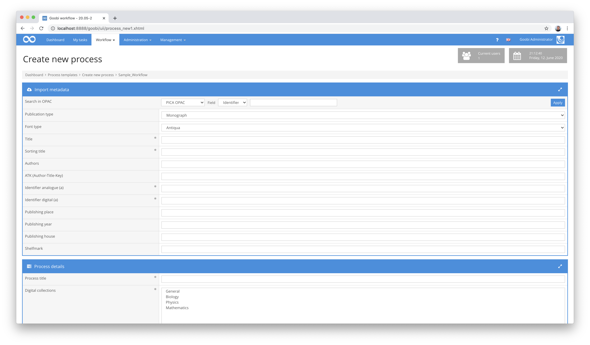

# PICA Import

## Introduction

This documentation describes the installation, configuration and use of the plugin. You can use this plugin to retrieve data from an external system and transfer it to Goobi. The catalog must have an API or URL that can be used to deliver records as OPACs.

| Details |  |
| :--- | :--- |
| Version | 1.0.0 |
| Identifier | intranda\_opac\_pica |
| Source code | [https://github.com/intranda/goobi-plugin-opac-pica](https://github.com/intranda/goobi-plugin-opac-pica) |
| Licence | GPL 2.0 oder neuer |
| Compatibility | 2020.05 |
| Documentation date | ​13.06.2020 |

## Installation

The plugin consists of one file:

```bash
plugin_intranda_opac_pica.jar
```

This file must be installed readable for the user `tomcat` at the following path

```bash
/opt/digiverso/goobi/plugins/opac/plugin_intranda_opac_pica.jar
```

## Configuration

The plugin itself does not have its own configuration. Instead, all configuration is carried out by making adjustments within Goobi workflow or the associated rule sets.

In the file `goobi_opac.xml`, the interface to the desired catalogue system must be made known. This is done by means of an entry that looks like this:

```markup
<catalogue title="PICA OPAC">
  <config address="kxp.k10plus.de" database="2.1"
    description="K10plus" iktlist="IKTLIST-GBV.xml" port="80"
    ucnf="UCNF=NFC&amp;XPNOFF=1" />
</catalogue>
```

The `title` attribute contains the name under which the catalog can be selected in the user interface, `address` the URL to the API endpoint and `database` the database to be used.

The content of a PICA record is mapped within the Goobi workflow ruleset used in each case. For more information on how to configure this mapping, see the UGH documentation here:



## Use

When you search for an identifier in Goobi, a request is sent to the configured URL in the background.



After retrieving the actual record from the PICA-catalog, the metadata is mapped according to the rules configured in the rule set.

