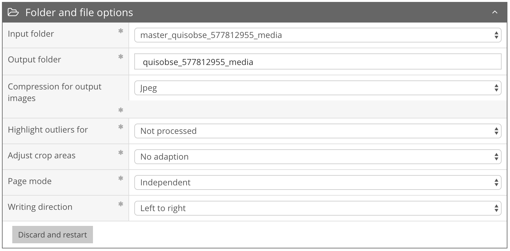
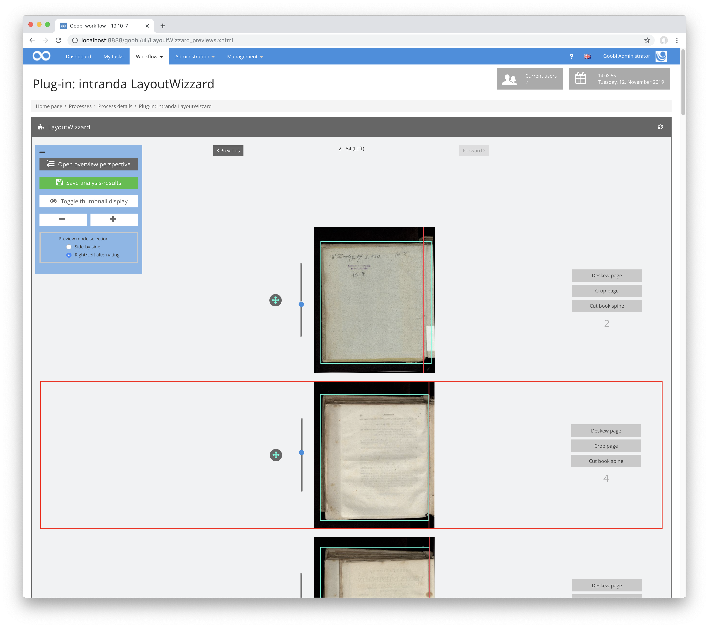

# Folder and file options

In the Folder and File Options area, global settings for handling files can be made. You can also reset the complete LayoutWizzard workflow from here.

## Switching between display modes

Within the overview, the mode for the display can be switched in the upper left corner. Usually the LayoutWizard opens in normal mode. The most important settings can already be edited directly here. If you want to display the advanced settings options, you can activate the advanced mode. Switching between the two display modes is possible by using this button in the title bar:

## Normal Mode

The following options are available in normal display mode.

### Page mode

The page mode is used to define the page processing in right, left, double or single pages. Each mode sets the orientation for all images once. Subsequent changes to the orientation of individual pages change the orientation of all subsequent pages as specified by the page mode. The internal name within the table below is the one used in the LayoutWizzard page mode configuration file.

| Page mode | Description | Internal name |
| :--- | :--- | :--- |
| **Alternating** | The images are treated alternately as right and left pages. The orientation of the first page depends on the `Write Direction` setting. | `ALTERNATING` |
| **Only left pages** | All images are treated as left pages. | `ALL_LEFT` |
| **Only right pages** | All images are treated as right sides. | `ALL_RIGHT` |
| **Double pages** | All images are treated as double pages. This means that they will be split into two single images when saved, if a fold line has been set. | `DOUBLE_PAGES` |
| **Double pages with covers** | The images are treated in the same way as in `Double Page mode`, except for the first and last page. These two pages are treated as `single pages`. | `DOUBLE_PAGES_WITH_COVERS` |
| **Single pages** | Each page is treated as a single sheet. This means that no book fold is cut. | `SINGLE_PAGES` |
| **Independent** | In this mode, all pages retain the current orientation. Changes to the orientation of individual pages have no effect on the following pages. | `INDEPENDENT` |

### Writing direction

The setting for the writing direction determines the direction in which the text flows. If the writing direction is `right-to-left`, the first page after binding is a right page in alternating page mode. If the writing direction is `left-to-right`, the first page after the cover is a left page. In case of the `double page mode`, the respective part of the double page is saved as a separate file in the corresponding order before the other part of the double page.

| Writing direction | Description |
| :--- | :--- |
| Left-to-right | In alternate page mode, the first page after binding is a left page. In double page mode, the left page of a double page comes before the right page in the page order. |
| Right-to-left | In alternate page mode, the first page after binding is a right page. In double page mode, the right page of a double page comes before the left page in the page order. |

### Discard and restart

With the button Discard and start over all LayoutWizzard data for this operation can be deleted. This includes all analysis data as well as the configuration specific to this process. After clicking on this button, a menu will open where you can select the desired template for the new configuration. A subsequent click on `OK` discards all previous data and creates a new configuration for the process based on the selected template.

## Extended mode

The following options are only available in advanced mode.

### Input folder

The Input folder defines the folder within the `images` folder of the Goobi operation from which the original images are read. This is usually the folder containing the master digitised images.

### Output folder

The output folder specifies the folder within the `images` folder of the Goobi operation in which the clipped derivatives are to be saved. This is usually the derivatives folder.

### Compression of the output images

This option allows you to specify how the compression of images created after cropping should be performed. Basically the derivatives are saved in Tiff format. However, here you can specify whether the images within the Tiff container should be compressed using JPEG compression.

| **Compression** | Description |
| :--- | :--- |
| **None** | Uncompressed Tiff |
| **JPEG** | JPEG-compressed Tiff |

### Mark outliers

Outliers are images that show strikingly different values in the analysis than the maximum of 12 images before and after them. Outliers are also images whose analysis could not be completed due to errors or timeouts. Outliers are displayed in red in the file list and surrounded by a red frame in the preview view.

The following outlier types are distinguished and can be selected as to be marked:

| Outlier types | Description |
| :--- | :--- |
| **Rotation** | The angle of the lateral alignment is striking. |
| **Page size** | The size of the cutting frame is striking. |
| **Book spine position** | The distance of the book spine from the page margin is striking. |
| **Not processed** | The image could not be fully analyzed. |
| **All** | All types of outliers mentioned above should be marked. |
| **None** | Outliers should not be marked at all. |

### Adjust cutting areas

If right and left images are scanned separately, but still need to fit together in a double-page view, LayoutWizzard can crop pages so that the content starts at the same height, so that the upper book edge is as flush as possible on all pages. Please note, however, that depending on the recording, it is often not possible to cut two pages completely flush without distortion. For an optimal double-page display, a double-page scan is therefore always recommended instead of this option.

| **Adjustment** mode | Description |
| :--- | :--- |
| **No adjustment** | The adjustment is switched off. |
| **Adjustment of opposite sides, left to right** | Opposite sides are cut flush with each other. The opposite side of a left page is always the following right page. |
| **Adjustment of opposite sides, right to left** | Opposite sides are cut flush with each other. The opposite side of a right-hand page is always the following left-hand page. |
| **Adjustment on all sides** | All sides are cut as flush as possible. This often causes large untrimmed edges, requires relatively long processing time and is therefore usually not recommended. |

