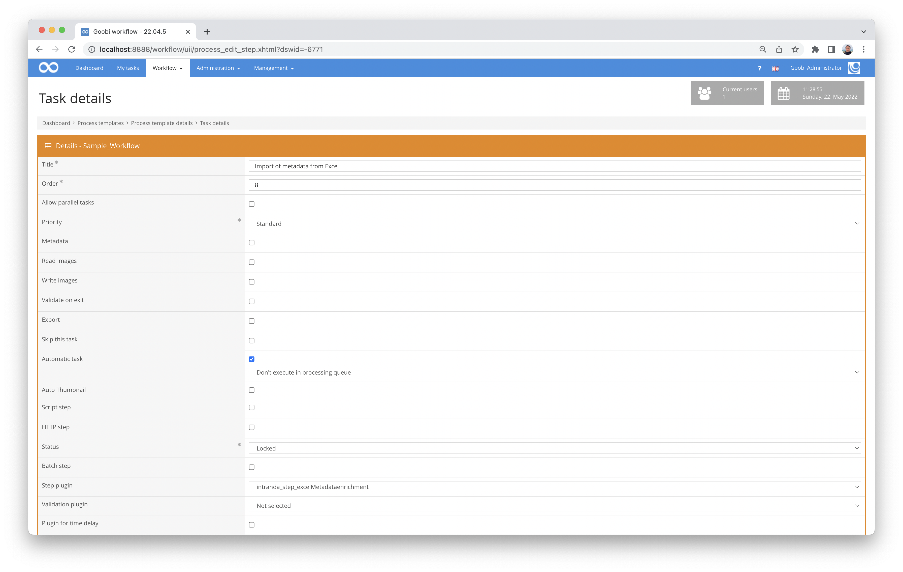

# Metadata enrichment via Excel file

## Introduction

This plugin allows metadata to be read from an Excel file and added to existing structural elements.

## Overview

| Details |  |
| :--- | :--- |
| Identifier | intranda_step_excelMetadataenrichment |
| Source code | [https://github.com/intranda/goobi-plugin-step-excel-metadataenrichment](https://github.com/intranda/goobi-plugin-step-excel-metadataenrichment) |
| Licence | GPL 2.0 or newer |
| Documentation date | 29.03.2022 |


## Installation
To install the plugin, the following file must be installed:

```bash
/opt/digiverso/goobi/plugins/step/plugin_intranda_step_excelMetadataenrichment.jar
```

To configure how the plugin should behave, various values can be adjusted in the configuration file. The configuration file is usually located here:

```bash
/opt/digiverso/goobi/config/plugin_intranda_step_excelMetadataenrichment.xml
```

## Configuration of the plug-in
The configuration of the plug-in is structured as follows:

```xml
<config_plugin>
    <!--
        order of configuration is:
          1.) project name and step name matches
          2.) step name matches and project is *
          3.) project name matches and step name is *
          4.) project name and step name are *
    -->

    <config>
        <!-- which projects to use for (can be more then one, otherwise use *) -->
        <project>*</project>
        <step>*</step>

        <!-- name of the folder to find the excel file -->
        <!-- can be part of the process folder (master, media, import, ...) or an absolute path -->
        <!-- if more then one excel file was found, the filename must match the process name -->
        <excelFolder>master</excelFolder>

        <!-- name of the identifier field in existing docstructs-->
        <docstructIdentifier>shelfmarksource</docstructIdentifier>


        <!-- define which column is the one to use for catalogue requests -->
        <excelIdentifierColumn>0-Signatur</excelIdentifierColumn>

        <metadata ugh="CatalogIDSource" headerName="2-PPN-A" />
        <metadata ugh="CatalogIDDigital" headerName="3-PPN-O" />
        <metadata ugh="Subject" normdataHeaderName="13-GND Schlagwort 1" headerName="13a-GND Schlagwort 1"/>
        <metadata ugh="Subject" normdataHeaderName="14-GND Schlagwort 2" headerName="14a-GND Schlagwort 2"/>

        <person ugh="Author">
            <!-- use this field if the column contains the complete name -->
            <nameFieldHeader>Author</nameFieldHeader>
            <!-- set this field to true, if the name must be splitted into first- and lastname. The complete name gets written into lastname -->
            <splitName>true</splitName>
            <!-- define at which character the name is separated. @firstNameIsFirstPart defines, if the firstname is the first or last part of the name -->
            <splitChar firstNameIsFirstPart="false">, </splitChar>
            <!-- use this fields, if the firstname and lastname are in different columns -->
            <!--
            <firstname>5-Vorname</firstname>
            <lastname>6-Nachname</lastname>
            -->
        </person>
    </config>
</config_plugin>
 ```

 The block `<config>` can occur repeatedly for different projects or work steps in order to be able to carry out different actions within different workflows.

 The field `<excelFolder>` defines where the Excel file is searched for. The Goobi internal variables can be used to define e.g. the process folder or the master folder. Alternatively, an absolute path can be specified where all excel files to be imported are located. If there is more than one excel file in the configured directory, a file 'PROCESSNAME.xlsx' is expected.

 The fields `<docstructIdentifier>` and `<excelIdentifierColumn>` are used to define the name of the metadatum and the Excel column via which the individual lines of the Excel file can be assigned.

 The configuration of the metadata and personal data to be imported is already described here:






## Integration of the plug-in into the workflow
To put the plugin into operation, it must be activated for a task in the workflow. This is done as shown in the following screenshot by selecting the plugin `plugin_intranda_step_excelMetadataenrichment` from the list of installed plugins.



Since this plugin should usually be executed automatically, the work step should be configured as automatic in the workflow.

## How the plugin works

After the plugin has been fully installed and set up, it is usually executed automatically within the workflow so that there is no manual interaction with the user. Instead, the workflow invokes the plugin in the background and performs the following tasks:

First, a suitable Excel file is searched for. The configured path is searched. If a single Excel file exists there, it is opened regardless of its name. If there are several Excel files, it is expected that the Excel file is named after the process name.

If an Excel file is found, the metadata is read. All existing structure elements are listed and checked whether they contain a metadatum that corresponds to the configured value in the field `<docstructIdentifier>`. If this is the case, the Excel file is searched for a row in which the metadatum was used in the column configured in the field `<excelIdentifierColumn>`. If it is found, the metadata of the row is added to the structure item.
