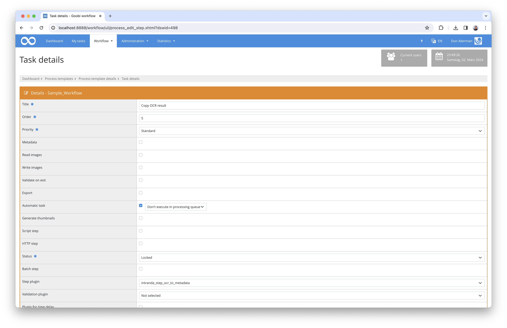

# Ocr to Metadata


## Introduction
This step plugin for Goobi workflow automatically reads in and combines ocr results and then saves it into a configurable metadata field in the mets file.

| Details |  |
| :--- | :--- |
| Identifier | intranda_step_ocr_to_metadata |
| Source code | [https://github.com/intranda/goobi-plugin-step-ocr-to-metadata](https://github.com/intranda/goobi-plugin-step-ocr-to-metadata) |
| Licence | GPL 2.0 or newer |
| Compatibility | Goobi workflow 2023.04 |
| Documentation date | 30.May.2023 |


## How the plugin works
The plugin checks first whether the OCR text folder or the OCR alto folder already exists, if so then the contents of its files will be read in and combined and then saved into a metadata field named as configured in the following way:
If such a metadata field already exists, then its contents will be replaced. Otherwise a new metadata field named so will be added. 


## Installation
The plugin consists of the following files:

```text
plugin_intranda_step_ocr_to_metadata.jar
plugin_intranda_step_ocr_to_metadata.xml
```

The file `goobi_plugin_step_ocr_to_metadata.jar` must be installed in the correct directory so that it is available at the following path after installation:

```bash
/opt/digiverso/goobi/plugins/step/plugin_intranda_step_ocr_to_metadata.jar
```

In addition, there is a configuration file that must be located in the following place:

```bash
/opt/digiverso/goobi/config/plugin_intranda_step_ocr_to_metadata.xml
```

## Configuration

The configuration of the plugin is done via the configuration file `plugin_intranda_step_ocr_to_metadata.xml` and can be adjusted during operation. The following is an example configuration file:

```xml
<?xml version="1.0" encoding="UTF-8"?>
<config_plugin>
    <!--
        order of configuration is:
          1.) project name and step name matches
          2.) step name matches and project is *
          3.) project name matches and step name is *
          4.) project name and step name are *
    -->
    
    <config>
        <!-- which projects to use for (can be more then one, otherwise use *) -->
        <project>*</project>
        <step>*</step>
        
        <!-- Name of the field where to store the OCR result -->
        <metadataField>AdditionalInformation</metadataField>
        
    </config>

</config_plugin>
```

| Parameter | Explanation |
| :--- | :--- |
| `project` | This parameter determines the project for which the current block `<config>` is to apply. The name of the project is used here. This parameter can occur several times per `<config>` block. |
| `step` | This parameter controls for which workflow steps the block `<config>` is to apply. The name of the step is used here. This parameter can occur several times per `<config>` block. |
| `metadataField` | This parameter defines the type's name of the metadata field that should be used to store the ocr result.  |


## Integration of the plugin into the workflow
This plugin is integrated into the workflow in such a way that it is executed automatically. Manual interaction with the plugin is not necessary. For use within a workflow step, it should be configured as shown in the screenshot below.


