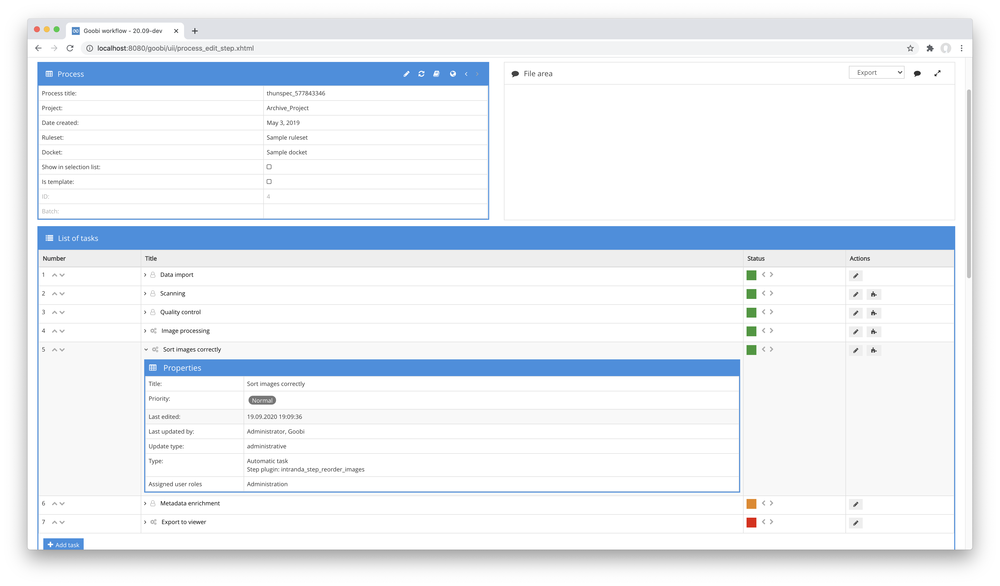

# Reorder Images

## Introduction

The plugin allows automatic sorting of image files that were not created continuously during creation and instead were saved separately for left and right pages. This is useful if, for example, an opening angle of a book that is too small prohibits the scanning of left and right pages simultaneously.

## Overview

| Details |  |
| :--- | :--- |
| Identifier | intranda\_step\_reorder\_images |
| Source code | [https://github.com/intranda/goobi-plugin-step-reorder-images](https://github.com/intranda/goobi-plugin-step-reorder-images) |
| Licence | GPL 2.0 or newer |
| Compatibility | Goobi workflow 2020.09 |
| Documentation date | 04.10.2020 |

## Installation

To install the plugin, the following file must be installed:

```bash
/opt/digiverso/goobi/plugins/step/plugin_intranda_step_reorder_images.jar
```

To configure how the plugin should behave, various values can be adjusted in the configuration file. The configuration file is usually located here:

```bash
/opt/digiverso/goobi/config/plugin_intranda_step_reorder_images.xml
```

## Configuration of the plugin

The configuration of the plugin is structured as follows:

```markup
<config_plugin>

    <config>
        <!-- which projects to use for (can be more then one, otherwise use *) -->
        <project>*</project>
        <step>*</step>

        <!-- which folder to use as source (master|media|jpeg|source|...) -->
        <sourceFolder>master</sourceFolder>

    <!-- which folder to use as target (master|media|jpeg|source|...) -->
        <targetFolder>media</targetFolder>

    <!-- use prefix from previous file name separated by following underscore -->
        <usePrefix>true</usePrefix>

    <!-- define if the first page is right or left -->
        <firstFileIsRight>true</firstFileIsRight>

    <!-- define which naming format shall be used; default is %04d -->
        <namingFormat>%04d</namingFormat>

    <!-- files to be ignored and moved to the end, can be multiple ones, used
            in the order as defined here, the string mentioned here has to be contained
            in file name -->
        <blacklist>_Spine_2</blacklist>
        <blacklist>_Spine_1</blacklist>
        <blacklist>_Colourchart</blacklist>
    </config>

</config_plugin>
```

The block `<config>` can occur repeatedly for different projects or workflow steps in order to be able to carry out different actions within different workflows. The other parameters within this configuration file have the following meanings:

| Value | Description |
| :--- | :--- |
| `project` | This parameter determines the project for which the current block `<config>` is to apply. The name of the project is used here. This parameter can occur several times per `<config>` block. |
| `step` | This parameter controls for which workflow steps the block `<config>` is to apply. The name of the step is used here. This parameter can occur several times per `<config>` block. |
| `sourceFolder` | This parameter specifies the directory from which the files are to be read. This is usually the master directory \(`master`\). |
| `targetFolder` | Here you can specify the folder to which the reordered files are saved. This is usually the directory `media`. |
| `usePrefix` | If a prefix is to be taken into account for the conversion, which precedes the file name and ends with an underscore, this can be defined here. |
| `firstFileIsRight` | Since the plugin proceeds differently whether the first file is a right or left page, this can be specified here. |
| `namingFormat` | The files are given new file names after they are re-sorted. How these should look like can be defined with a regular expression. The default value for this is `%04d`, which generates 4-digit numbers for the file names. |
| `blacklist` | If selected files within the sorting are to be ignored and placed at the end of the previously sorted files, they can be named here. The files will be placed at the end of the list in the order in which they are listed here. They will then also receive a new file name that counts upwards. |

## Integration of the plugin into the workflow

To use the plugin, it must be activated for one or more desired tasks in the workflow. This is done as shown in the following screenshot by selecting the plugin `intranda_step_reorder_images` from the list of installed plugins.



Since this plugin is usually to be executed automatically, the step in the workflow should be configured as automatic.

## How the plugin works

Once the plugin is fully installed and set up, it is usually executed automatically within the workflow, so there is no manual interaction with the user. Instead, the plugin is called by the workflow in the background and starts the re-sorting and renaming of the files depending on the selected configuration.

