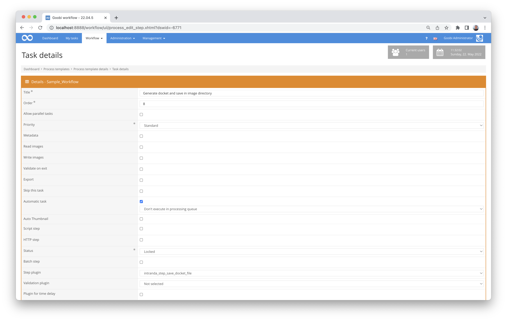

# Generation of docket files

## Introduction

This plugin can be used in any task to automatically generate and save a docket when the task is processed. The plugin supports PDF and TIFF files.

## Overview

| Details |  |
| :--- | :--- |
| Identifier | intranda\_step\_save_docket_file |
| Source code | [https://github.com/intranda/goobi-plugin-step-save-docket-file](https://github.com/intranda/goobi-plugin-step-save-docket-file) |
| License | GPL 2.0 or newer |
| Compatibility | Goobi workflow 2022.04 |
| Documentation date | 28.04.2022 |

## Installation

The following file must be present to install the plugin:

```bash
/opt/digiverso/goobi/plugins/step/plugin_intranda_step_save_docket_file.jar
```

To configure how the plugin should behave, various values can be adjusted in the configuration file. The configuration file is usually located here:

```bash
/opt/digiverso/goobi/config/plugin_intranda_step_save_docket_file.xml
```

## Configuration of the plugin

The configuration of the plugin is as follows:

```markup
<config_plugin>
    <!--
        order of configuration is:
          1.) project name and step name matches
          2.) step name matches and project is *
          3.) project name matches and step name is *
          4.) project name and step name are *
    -->
    <config>
        <!-- which projects to use for (can be more then one, otherwise use *) -->
        <project>*</project>
        <step>*</step>

        <template file="/opt/digiverso/goobi/xslt/docket.xsl" />


        <!-- mimeType: image/tiff or application/pdf -->
        <!-- filename: name of the output file-->
        <!-- folder: name of the output folder, e.g. 'master' or 'media' -->
        <output mimeType="image/tiff" filename="00000000.tif" folder="master" />

        <!-- Set the number of dots per inch for the output file here. Common values are 300 or 600 -->
        <dotsPerInch>150</dotsPerInch>

    </config>
</config_plugin>
```

| Value | Description |
| :--- | :--- |
| `project` |  This parameter specifies for which project the current `<config>` block should apply. The name of the project is used here. This parameter can occur multiple times per `<config>` block. If the value is set to `*`, all projects will be considered. |
| `step` | This parameter defines for which work steps the `<config>` block should apply. The name of the step is used here. This parameter can occur several times per `<config>` block. If the value is set to `*`, all work steps will be considered. |
| `template` | This element specifies which docket template should be used for generation. The `file` parameter specifies an absolute file path to an existing `.xsl` file. |
| `output` | This element specifies where and how the destination file should be stored. The `folder` parameter specifies the corresponding subfolder within the `images` folder of a project. For example, `master` or `media` can be selected here. The `filename` parameter specifies the file name. The file extension must match the specified MimeType. This is configured with the `mimeType` parameter and can be set to either `image/tiff` or `application/pdf`. |
| `dotsPerInch` | This value specifies the resolution of the exported document. The unit is pixels per inch. The default value is 150 DPI. |

## Use of the plugin

In case of an automatic task, the plugin will be executed automatically as soon as the corresponding task is executed. There is an additional button at the corresponding task in the task details, with which the docket can be generated manually at any time.

## Anwendung des Plugins
This plugin is integrated into the workflow in such a way that it is executed automatically. Manual interaction with the plugin is not necessary. For use within a work step of the workflow, it should be configured as shown in the screenshot below.


