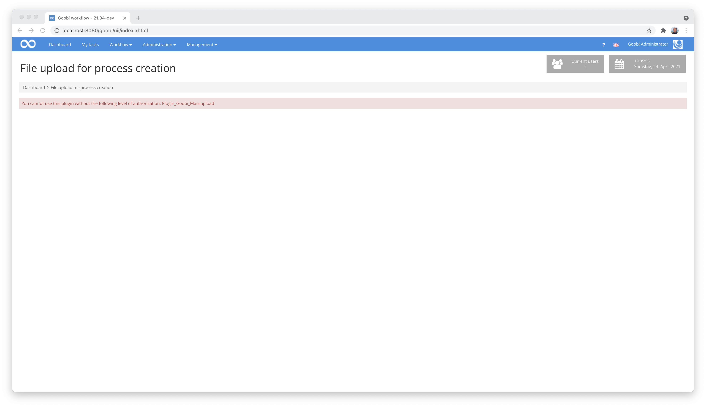
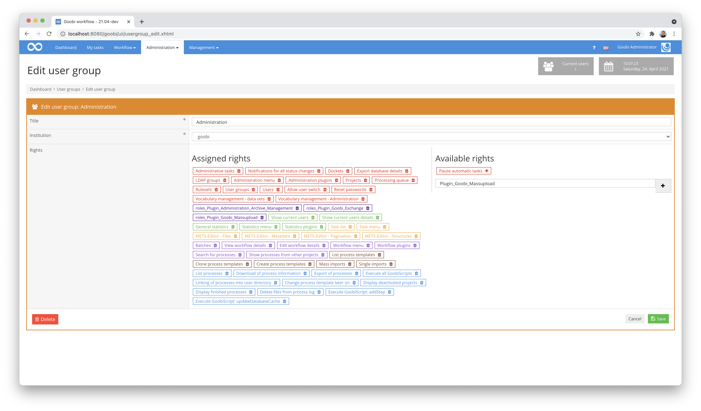
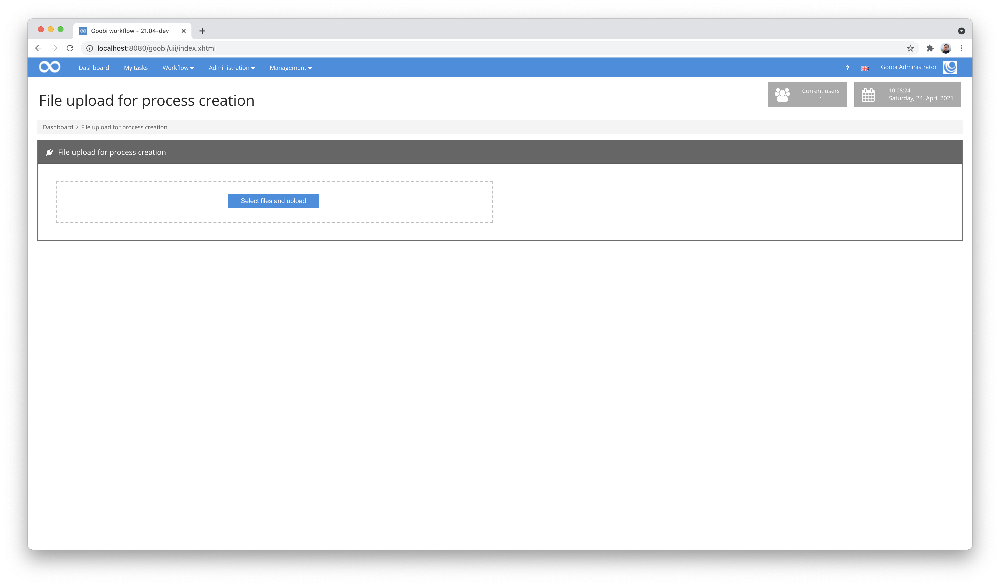

# Process creation through file upload

## Introduction

This workflow plugin allows a mass upload of files on the basis of which Goobi processes are automatically generated. The process template to be used as well as the publication type to be created can be defined via a configuration. Files that belong together are automatically assigned after the process has been created.

## Overview

| Details |  |
| :--- | :--- |
| Identifier | intranda_workflow_fileUploadProcessCreation |
| Source code | [https://github.com/intranda/goobi-plugin-workflow-fileupload-processcreation](https://github.com/intranda/goobi-plugin-workflow-fileupload-processcreation) |
| Licence | GPL 2.0 oder neuer |
| Compatibility | Goobi workflow 20.12 |
| Documentation date | 24.04.2021 |

## Installation

To install the plugin, the following two files must be installed:

```bash
/opt/digiverso/goobi/plugins/workflow/plugin_intranda_workflow_fileUploadProcessCreation.jar
/opt/digiverso/goobi/plugins/GUI/plugin_intranda_workflow_fileUploadProcessCreation-GUI.jar
```

To configure how the plugin should behave, various values can be adjusted in the configuration file. The configuration file is usually located here:

```bash
/opt/digiverso/goobi/config/plugin_intranda_workflow_fileUploadProcessCreation.xml
```

The content of this configuration file looks like this:

```xml
<config_plugin>
	
	<!-- which file types shall be allowed for uploading these -->
	<allowed-file-extensions>/(\.|\/)(gif|jpe?g|png|tiff?|jp2|pdf)$/</allowed-file-extensions>

	<!-- which process template shall be used to create the new processes -->
	<processTemplateName>ImportWorkflow</processTemplateName>

	<!-- which publication type shall be used inside of the created METS files -->
	<metadataDocumentType>Monograph</metadataDocumentType>

	<!-- define a naming schema for the file names to be matched for the process creation -->
	<namingSchema>/.*(BA_\\d+[_-](\\d+)).*\\.jpg/</namingSchema>

</config_plugin>
```

To use this plugin, the user must have the correct role authorisation.



Therefore, please assign the role `Plugin_Goobi_Massupload` to the group.



## Explanation of the configuration options

The configuration of the plugin is as follows:

| Value | Description |
| :--- | :--- |
| `allowed-file-extensions` | This parameter defines which files may be uploaded. This is a regular expression. |
| `processTemplateName` | This parameter can be used to define which process template is to be used for the processes to be created. |
| `metadataDocumentType` | Use this to specify which publication type is to be used within the METS file for the new processes to be created. |
| `namingSchema` | Define a regular expression here that should apply to the naming scheme of the uploaded files. This is decisive for the creation of the processes and the association of the images to the processes. |

## Operating the plugin

If the plugin has been installed and configured correctly, it can be found within the menu item `Workflow`.



Files can now be uploaded at this point. After analysing the file names, Goobi automatically creates the corresponding processes.